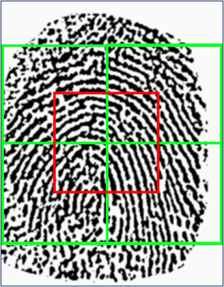

# Fingerprint Liveness Detection
We first extract features from fingerprint images and then develop machine learning models such as neural networks and SVM for classification of real and fake fingerprints. The feature extraction methods that we used were WLD, LPQ or some neural networks.
We were able to achieve, with the best approach, test accuracy ranging from 98% to 99%.

# Data set
We use the fingerprint images data set from "Liveness Detection Competitions 2015"  [Available Here](http://livdet.org/registration.php).

# Methods 1
The features have been extracted with an approach called LCPD obtained from the concatenation of a spatial component based on the WLD descriptor, and a phase component obtained from a version of the LPQ descriptor [Reference here](https://www.researchgate.net/publication/265164108_Local_contrast_phase_descriptor_for_fingerprint_liveness_detection).
In order to reduce the complexity and to prevent overfitting, PCA was applied to maintain 95% variance. The SVM model is then calibrated and applied.
The results are not satisfactory (about 50% accuracy)

# Methods 2
In order to have a larger training set, we also introduced new training data by augmenting available training images. Five square patches are extracted from the original train image.

 
